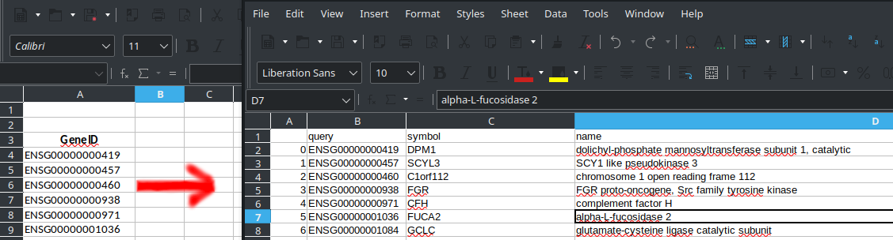

# pyEnsemblGeneId2GeneNameMassConvert

Returns tabular files containing Gene Name and Id from files containing Ensembl GeneId data. Suitable for mass conversions.
Uses `pandas` and `biothings_client`.

Author: A. Corbetta - http://corbetta.phys.tue.nl
Year: 2020

## Use as 

```bash
python geneidconverter.py <input_file>
```




## Dependencies
```bash
pip install pandas biothings_client
```


